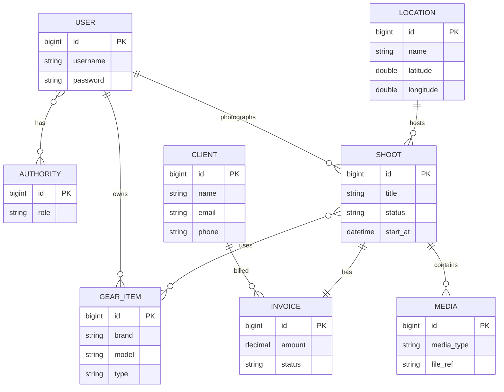

# Platformă web de gestiune a unei firme de fotografie

Aplicație web monolitică Spring Boot pentru planificarea ședințelor foto/video, gestionarea clienților, locațiilor, echipamentelor, facturilor și statisticilor unei firme de fotografie.

## Cerințele sistemului

1. Gestionarea clienților cu detaliile lor de bază (nume, email, telefon)
2. Gestionarea locațiilor cu nume și, opțional, detalii de geolocalizare
3. Crearea și actualizarea ședințelor foto/video cu titlu, programare, notițe și status
4. Atribuirea fiecărei ședințe unui fotograf
5. Asocierea opțională a echipamentelor necesare la ședințe pentru planificare mai eficientă
6. Atașarea elementelor media (fotografii/video) la o ședință și actualizarea metadatelor
7. Crearea și actualizarea unei facturi pentru fiecare ședință (fiecare factură are un singur client)
8. Urmărirea statusului plății și a sumelor pentru facturi
9. Obținerea detaliilor unei ședințe, fișierele media asociate și detaliile facturii
10. Obținerea statisticilor pentru un interval de timp setat de utilizator (venituri încasate, sume restante, ședințe planificate/finalizate)

## Tehnologii

| Layer | Tehnologie |
|-------|------------|
| Backend | Spring Boot 4, Java 21, Spring MVC |
| Persistență | Spring Data JPA, Hibernate |
| Baze de date | H2 (in-memory), PostgreSQL 16 |
| Securitate | Spring Security, BCrypt, roluri ADMIN / GUEST |
| UI | Thymeleaf, Bootstrap 5 (WebJars) |
| Mapping | MapStruct, Bean Validation |
| Build | Gradle |
| Containere | Docker Compose (PostgreSQL) |

## Arhitectură

Aplicația urmează o arhitectură în straturi (conform laboratoarelor AWBD):

```
Browser (Thymeleaf)
       ↓
Controller  — rute HTTP, formulare, validare @Valid
       ↓
Service     — logică de business, tranzacții
       ↓
Repository  — Spring Data JPA
       ↓
Entity      — model relațional
```

DTO-urile (`request` / `response`) și mapper-ele MapStruct separă entitățile JPA de datele expuse în UI.

### Pachete principale

| Pachet | Rol |
|--------|-----|
| `controller` | Endpoints MVC |
| `service` | Business logic |
| `repository` | Acces la date |
| `model.entity` | Entități JPA |
| `model.dto` | Formulare și răspunsuri |
| `config` | Security, Web, profiluri |
| `exception` | Excepții custom + `GlobalExceptionHandler` |

## Model de date (ER)

### Entități (8)

| Entitate | Descriere |
|----------|-----------|
| `User` | Utilizator autentificat (fotograf / admin) |
| `Authority` | Rol (`ROLE_ADMIN`, `ROLE_GUEST`) |
| `Client` | Client al firmei |
| `Location` | Locație de shoot (cu geolocație opțională) |
| `GearItem` | Echipament foto deținut de un fotograf |
| `Shoot` | Ședință foto/video |
| `Media` | Metadata media atașată unei ședințe |
| `Invoice` | Factură pentru o ședință |

### Relații JPA

| Tip | Relație |
|-----|---------|
| `@OneToOne` | `Shoot` ↔ `Invoice` |
| `@OneToMany` / `@ManyToOne` | `Shoot` → `Media`, `Shoot` → `Location`, `Shoot` → `User` (fotograf), `Invoice` → `Client`, `GearItem` → `User` |
| `@ManyToMany` | `Shoot` ↔ `GearItem`, `User` ↔ `Authority` |

### Diagramă ER



## Medii și profiluri Spring

| Profil | Bază de date | Utilizare |
|--------|--------------|-----------|
| `h2` | H2 in-memory | Dezvoltare și testare rapidă |
| `postgresql` | PostgreSQL (Docker) | Mediu apropiat de producție |

Scripturile SQL (`schema-h2.sql`, `schema-postgres.sql`) creează schema la pornire. `DataLoader` inserează utilizatorii impliciți dacă baza este goală.

## Cerințe

- **JDK 21**
- **Gradle** (wrapper inclus: `gradlew` / `gradlew.bat`)
- **Docker** (opțional, doar pentru profilul PostgreSQL)

## Rulare locală

### 1. H2 (recomandat pentru development)

```bash
./gradlew bootRun --args='--spring.profiles.active=h2'
```

Windows (PowerShell):

```powershell
.\gradlew.bat bootRun --args="--spring.profiles.active=h2"
```

Aplicația: http://localhost:8080

Consolă H2: http://localhost:8080/h2-console

| Câmp | Valoare |
|------|---------|
| JDBC URL | `jdbc:h2:mem:testdb` |
| User | `sa` |
| Password | *(gol)* |

### 2. PostgreSQL (Docker)

Pornește doar PostgreSQL:

```bash
docker compose up -d postgres
```

Rulează aplicația:

```bash
./gradlew bootRun --args='--spring.profiles.active=postgresql'
```

Dacă schema este incompletă sau coruptă, resetează volumul:

```bash
docker compose down -v
docker compose up -d postgres
```

### 3. IDE

Configurări incluse în `.run/`:

- `ProiectApplication-H2` — profil `h2`
- `ProiectApplication-Postgres` — profil `postgresql`

## Autentificare

| Utilizator | Parolă | Rol | Drepturi |
|------------|--------|-----|----------|
| `admin` | `admin` | ADMIN | CRUD complet |
| `guest` | `guest` | GUEST | Doar vizualizare (liste și detalii) |

Pagina de login: http://localhost:8080/login

Utilizatorii neautorizați pentru o acțiune sunt redirecționați către `/access_denied` (403).

## Logging

Aplicația folosește **SLF4J** cu **Logback** (`logback-spring.xml`).

| Destinație | Nivel | Fișier |
|------------|-------|--------|
| Consolă | INFO | — |
| Jurnal general | INFO | `logs/app.log` |
| Erori | ERROR | `logs/error.log` |

În profilul `h2`, pachetul `ro.fmi.awbd` este la nivel **DEBUG** (citiri, autentificare, seed). Operațiile CRUD din servicii sunt logate la **INFO**; erorile de business la **WARN**, excepțiile neașteptate la **ERROR**.

Directorul `logs/` este creat automat la pornire. Poți schimba locația cu variabila de mediu `LOG_PATH`.

## Teste

```bash
./gradlew test
./gradlew jacocoTestReport
```

Testele folosesc profilul `h2` cu bază de date in-memory izolată (`jdbc:h2:mem:awbd-${random.uuid}`).

| Tip | Locație | Ce verifică |
|-----|---------|-------------|
| **Unit** (Mockito) | `src/test/java/ro/fmi/awbd/service/` | Logică de business pentru toate serviciile |
| **Integrare** (MockMvc + `@WithMockUser`) | `src/test/java/ro/fmi/awbd/integration/` + smoke tests | Securitate roluri, fluxuri MVC, persistență |
| **Coverage** | JaCoCo (min. **70%** linii pe servicii) | `./gradlew jacocoTestCoverageVerification` |

Raport HTML coverage: `build/reports/jacoco/test/html/index.html`

### Scenarii integrare (MockMvc)

- Guest poate lista resurse, dar nu poate șterge (`ClientControllerSecurityTest`)
- Admin poate crea client (`ClientControllerIntegrationTest`)
- Guest listează ședințe; admin deschide formular nou (`ShootControllerIntegrationTest`)
- Stats cu și fără interval de timp (`StatsControllerIntegrationTest`)

## Flux funcțional recomandat (demo)

1. Autentificare ca `admin`
2. Creare **client** și **locație**
3. Înregistrare **echipament** (cu fotograf)
4. Creare **ședință** (fotograf + locație + echipament opțional)
5. Pe pagina ședinței: adăugare **media** și **factură**
6. Pagina **Stats**: interval de timp pentru venituri și număr ședințe
7. Autentificare ca `guest` — verificare că butoanele de editare/ștergere nu sunt vizibile

## Structură proiect

```
src/main/java/ro/fmi/awbd/
├── controller/       # MVC
├── service/          # Business logic
├── repository/       # JPA
├── model/            # entity, dto, enums, mapper
├── config/           # Security, Web
└── exception/        # Error handling

src/main/resources/
├── schema-h2.sql
├── schema-postgres.sql
├── application-h2.properties
├── application-postgresql.properties
├── logback-spring.xml
└── templates/        # Thymeleaf
```
